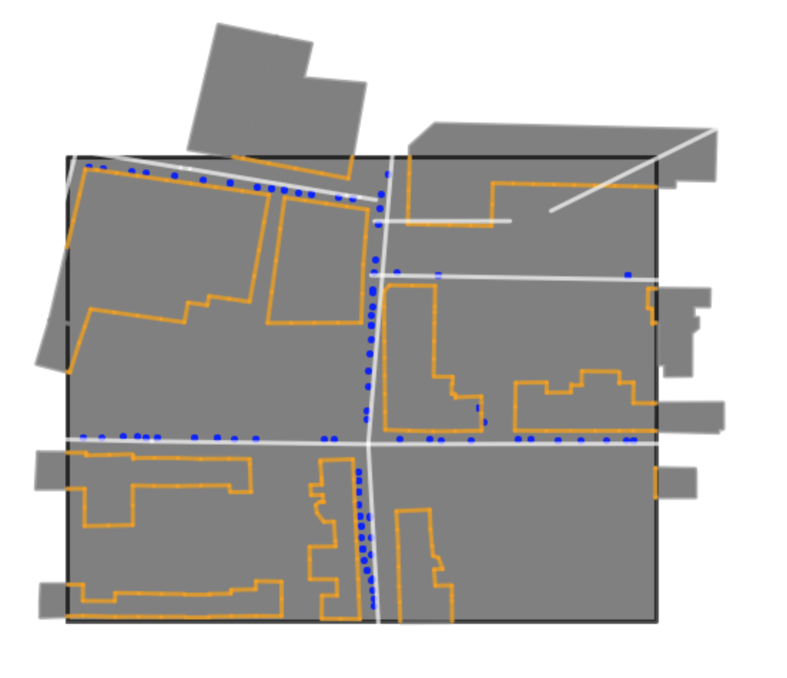
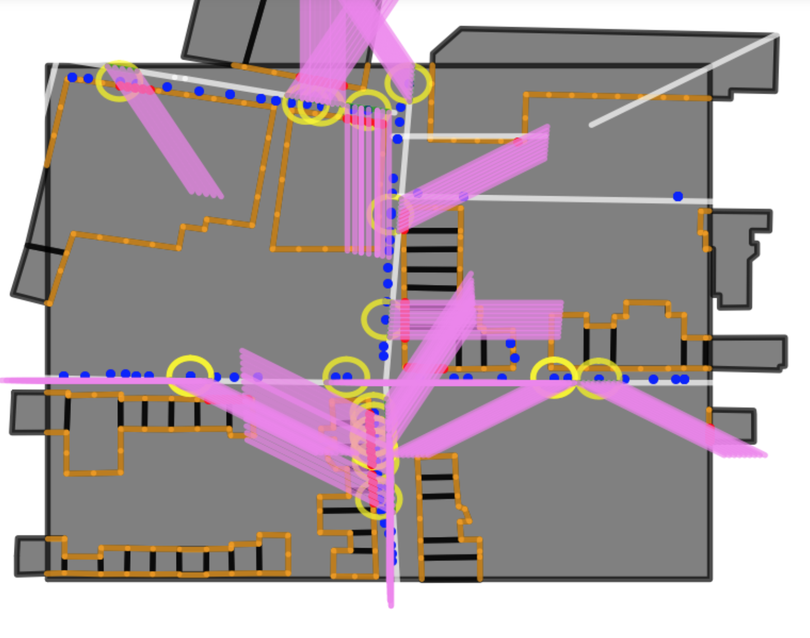
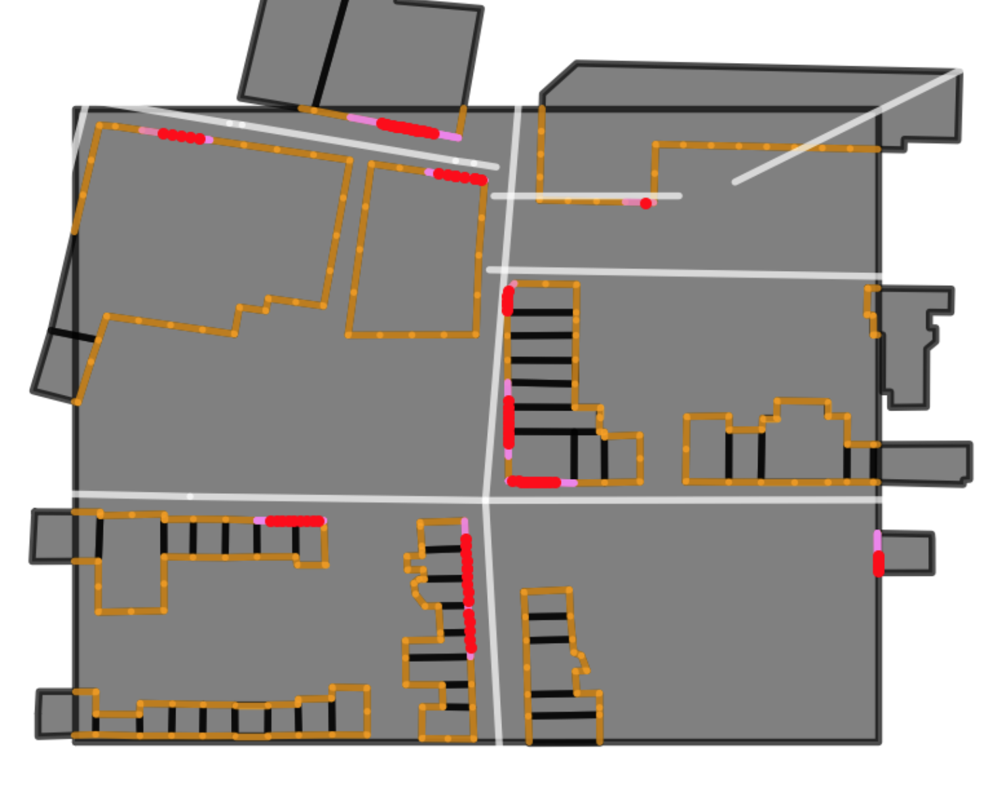

# Street Art Detection Engine

  


## Relevant Code for the paper *Detecting Building Facades with Graffiti ArtworkBased on Street View Images*


# Example Demo

 

```python
from Engine import Environment

```

Create a 2D model of the environment surrounding the indicator coordinate

```python
env = Environment(coords = (51.520404, -0.071797))

```
Plot Environment
```python
from SA_geometry import plot
plot(env.bbox, "black");
plot(env.gsv_points, "blue");
plot(env.aggregated, "grey");
plot(env.facades, "orange");
plot(env.streets, "white");

```
  

Evaluate the gsv points within the area of the environment. 
```python
# model=None indicates that the Neural Net is not used (toy example)
env.evaluate(model=None, radius=5,
                 dirrlength=40)
```
Plot evaluated environment
```python
plot(env.bbox, "black");
plot(env.aggregated, "grey");
plot(env.facades, "orange");
plot(env.streets, "white");
plot(env.gsv_points, "blue");
plot(env.ellipses, "yellow");
plot(env.interlines, "green");
plot(env.intersection_points, "red");
plot(env.headinglines, "violet")

```
  

Show relevant facades
```python
plot(env.bbox, "black");
plot(env.aggregated, "grey");
plot(env.facades, "orange");
plot(env.streets, "white");
plot(env.sa_facades, "violet");
plot(env.intersection_points, "red")

```
  

